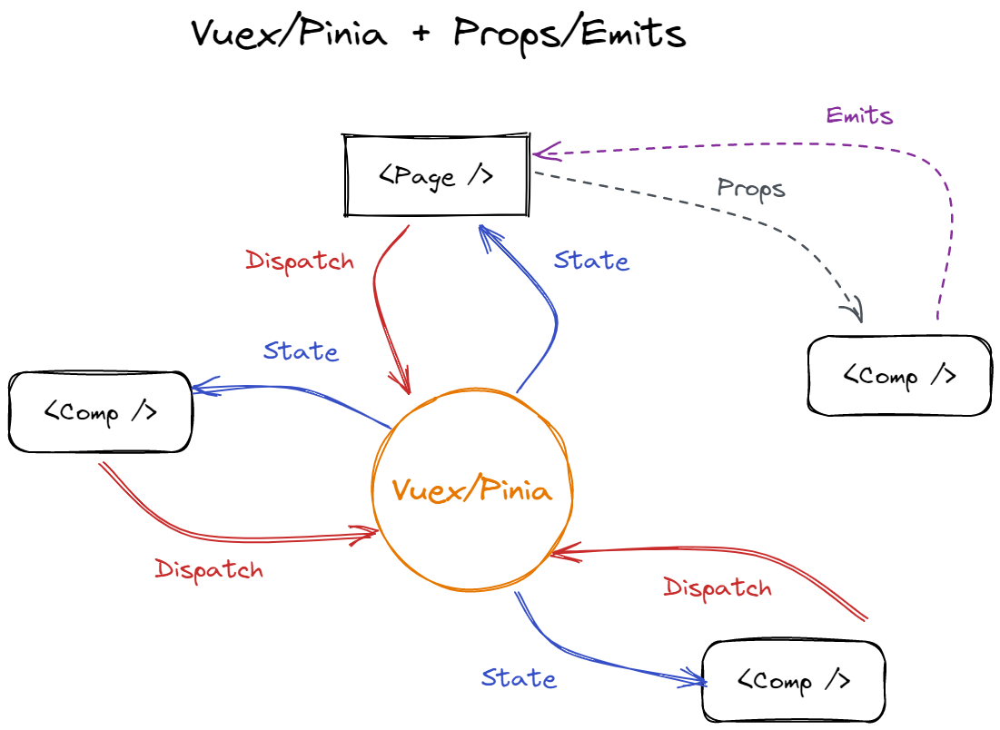
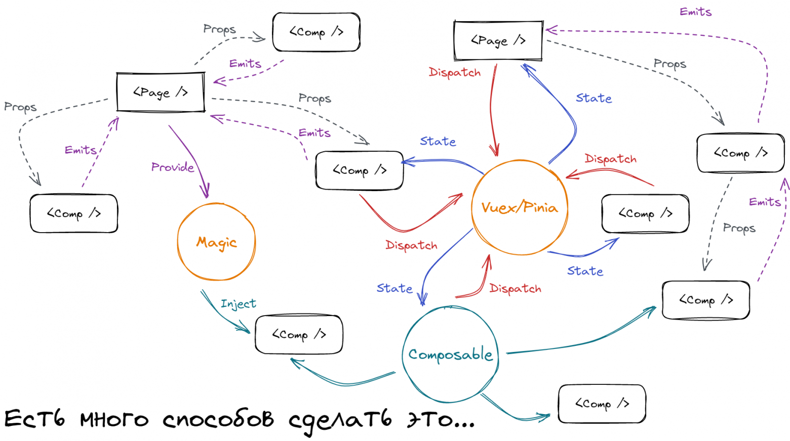

# Основная информация

## Папки и файловая структура

Для совместимости структура папок приведена к варианту Nuxt 4, согласно рекомендациям [апгрейда](https://nuxt.com/docs/getting-started/upgrade):

```
*
/frontend
    └── /app
        └── /assets
        └── /components
            └── /entities
            └── /features
            └── /shared
            └── /widgets
        └── /composables
        └── /layouts
        └── /middleware
        └── /pages
        └── /plugins
        └── /utils
        └── /types
        └── app.vue
        └── theme.ts
    └── /public
    └── /store
    └── /server
        └── /api
        └── /middleware
        └── /plugins
        └── /routes
        └── /utils
    └── /tests ?
    └── nuxt.config.ts
```

`*` - Корень проекта пока с настройками старого `docker-compose.yml`, но эту структуру желательно изменить (отделить ci-cd от frontend)

- /app/**assets**: Обрабатываемая статика изображений, стилей и других ресурсов
- /app/**components**: Многоразовые компоненты - [декомпозиция по FSD](<#декомпозиция-по-feature-sliced-design-(fsd)>)
- /app/**layouts**: Компоненты макета для разных страниц
- /app/**middleware**: Кастомные middleware.
- /app/**pages**: Компоненты, представляющие отдельные страницы (А так же слой "Pages" в рамках [FSD](https://feature-sliced.github.io/documentation/ru/))
- /app/**plugins**: Плагины Nuxt с возможностью инициализировать доп функционал на старте приложения, глобально, с контролем порядка запуска.
- /app/**composables**: Новая прослойка вспомогательных функций с возможностью хранения состояния (Рекомендую использовать максимально изолированно - ввиду неявной связанности и усложнения структуры кода при росте их количества. Но если очень хочется вынести всю сложную логику из компонента и сделать его лаконичным - не запрещается).
- /app/**utils**: Вспомогательные функции и хелперы, [не связанные с функционалом хранения состояния](https://nuxt.com/docs/guide/directory-structure/utils).
- /app/**public**: аналогично `static` из версии Nuxt2 - статика для доступа по ссылке
- **store**: Хранилище (стора)
- **tests**: Файлы тестов

### Декомпозиция по Feature-Sliced Design (FSD)

Структуру папок компонентов предлагается организовать в соответствии с методологией **Feature-Sliced Design (FSD)**.  
Этот подход обеспечивает **масштабируемость**, **читаемость** и **переиспользуемость** кода.  
Основные слои и их назначение:

- **`entities`**: Базовые сущности приложения (например, `User`, `Product`).
- **`features`**: Функциональные возможности (например, `Auth`, `Search`).
- **`shared`**: Общие компоненты и утилиты (например, `Button`, `Input`).
- **`widgets`**: Самостоятельные блоки, используемые на нескольких страницах (например, `Header`, `Footer`).

#### Автоимпорт

Для удобства использования компонентов настроен автоимпорт с учётом FSD:

- Компоненты из любого слоя доступны без префиксов папок, к которых они находятся (например, `components/widgets/Header.vue` импортируется как `<Header />`).

#### Пример:

```
/components
  /entities
    BodyCell.vue          --> <BodyCell />
    /Table
      BodyCell.vue        --> <TableBodyCell />
  /features
    /Auth
      LoginForm.vue       --> <AuthLoginForm />
  /shared
    /ui
      Button.vue          --> <UiButton />
  /widgets
    /Header
      NavLink.vue         --> <HeaderNavLink />
```

#### Полезные ссылки

- [Памятка: Как выбрать слой для компонента](https://feature-sliced.design/ru/assets/files/choosing-a-layer-ru-da11f37d28524420f3c747671072cf49.pdf)
- [Официальная документация FSD](https://feature-sliced.design/ru/docs)
- [Преимущества FSD](https://feature-sliced.design/ru/docs/get-started/benefits)

## Основные паттерны

### Двустороннее взаимодействие компонентов Vue

Используем для "дальностоящих" общих данных взаимодействие через **global store (Pinia)**
А для локальных данных при ["props drilling"](https://vuejs.org/guide/components/provide-inject.html#prop-drilling) не более чем 2 компонента вниз - **props/emits**



_Local state в composables_ используем для вынесения локальной логики и возможного переиспользования
_provide/inject_ по возможности не используем, для упрощения и повышения читабельности архитектуры

Здесь важно понимать, что любая неочевидная связь приносит с собой возможные скрытые эффекты, о которых будет знать и помнить (пока) тот разработчик, который это всё разрабатывал.



[более подробная статья на хабре](https://habr.com/ru/articles/668072/)

### Композаблы и утилиты

Если ваша функция принимает на вход определенные числа и возвращает наименьшее значение из них, то у такой функции нет работы с состоянием, а значит это не может называться composable, в действительности это функция утилита.

#### ✏️ Чеклист для определения Vue composable

- Ваша функция внутри себя использует методы жизненного цикла. (onMounted, onBeforeUnmount и т.д.)
- Ваша функция внутри себя использует другие composables
- У вашей функции есть логика работы с состоянием (stateful logic)

[Источник](https://habr.com/ru/articles/805491/)
